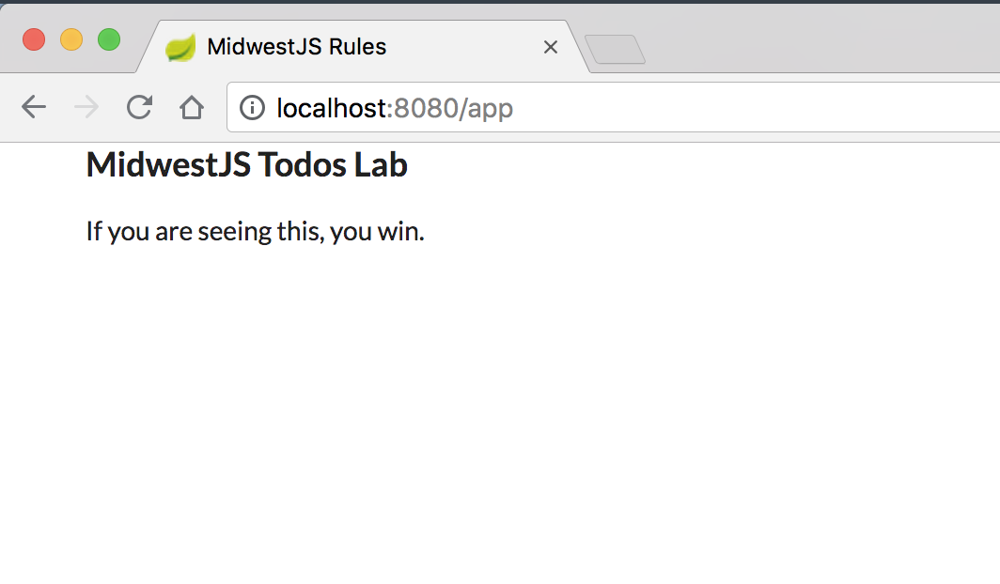

# Project Setup

### Install project dependencies

1. Install Java + add to path.
2. Install VS Code / Intellij Community Edition

### Create Spring Boot Project
1. Clone repository
  - https://guides.gradle.org/creating-new-gradle-builds/
  - https://start.spring.io/

2. Create settings.gradle
  - rootProject.name
  - include sub projects

*settings.gradle*

```bash
rootProject.name = 'midwest-js-todos'

include 'todo-js'
include 'todo-proxy'
```

3. Create `build.gradle` in `todo-js`
  - just the description of the project for now.

*todo-js/build.gradle*

```bash
description = """Javascript and React project for Todos"""
```

4. Review/Update `build.gradle` in `todo-proxy`

*todo-proxy/build.gradle*

```java
// line 10
apply plugin: "groovy"
apply plugin: "war"
apply plugin: "org.springframework.boot"
apply plugin: "io.spring.dependency-management"

// line 29
dependencies {
  compile "org.codehaus.groovy:groovy"
  compile "org.springframework.boot:spring-boot-starter-web"
  compile "org.springframework.boot:spring-boot-devtools"

  providedRuntime "org.springframework.boot:spring-boot-starter-tomcat"

  testCompile "junit:junit"
}
```

5. Add static/index.html

*todo-proxy/src/main/resources/static/index.html*

```html
<!doctype>
<html lang="en">
  <head>
    <meta charset="utf-8">
    <meta name="viewport" content="width=device-width, initial-scale=1, shrink-to-fit=no">
    <link rel="stylesheet" href="https://cdn.jsdelivr.net/npm/semantic-ui@2.3.3/dist/semantic.min.css">
    <title>MidwestJS Rules</title>
  </head>
  <body>
    <div class="ui container">
      <h3>MidwestJS Todos Lab</h3>
      <p>If you are seeing this, you win.</p>
    </div>
  </body>
</html>
```

6. Set up Web Configuration to point to index.


*todo-proxy/src/main/groovy/com/flyover/midwestjs/configuration/WebConfiguration.groovy*

```java
  @Bean
  WebMvcConfigurer forwardToIndex() {
      new WebMvcConfigurer() {
          @Override
          void addViewControllers(ViewControllerRegistry registry) {
              // Resolve requests to / and /app to index.html so that HTML5 routing works
              registry
                      .addRedirectViewController("/", "/app")

              registry
                      .addViewController("/app/**")
                      .setViewName(INDEX_HTML)
          }
      }
  }
```

7. Run App and see page

```bash
./gradlew bootRun
```



8. Commit your changes

```bash
git add .

git commit -m 'Spring boot proxy application created successfully'
```