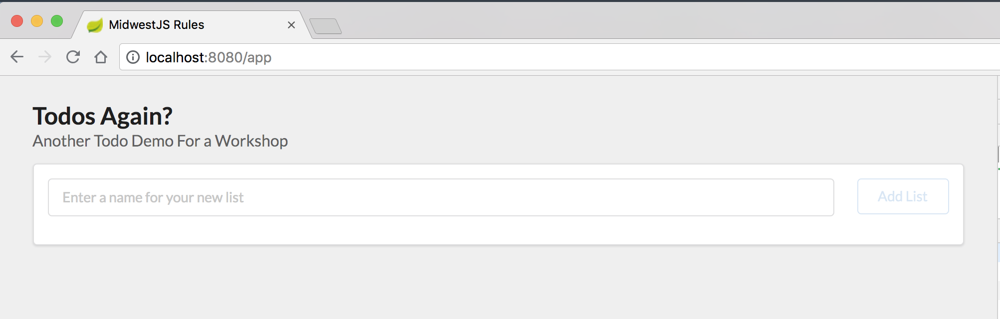

# Javascript Module Setup

1. Review the JS project
  - [NPM: Node's package manager](https://www.npmjs.com/)
  - [Webpack: Bundler](https://webpack.js.org/)
  - [JS Modules in Browsers](https://jakearchibald.com/2017/es-modules-in-browsers/)

2. Initialize NPM project

*todo-js folder*

```bash
npm init
```

```
package name: (todo) midwest-js-todos
version: (1.0.0)
description: Todos project for MidwestJS
entry point: (index.js)
test command: test
git repository:
keywords:
author: your name
license: (ISC)
About to write to /<path-to-your-project>/package.json:

{
  "name": "midwest-js-todos",
  "version": "1.0.0",
  "description": "Todos project for MidwestJS",
  "main": "webpack.config.js",
  "scripts": {
    "test": "test"
  },
  "author": "your name",
  "license": "ISC"
}


Is this OK? (yes)
```

3. Add Dependencies

```json
"dependencies": {
  "react": "^16.4.1",
  "react-dom": "^16.4.1",
  "react-router": "^4.3.1",
  "semantic-ui-react": "^0.82.1"
},
"devDependencies": {
  "babel-core": "^6.26.3",
  "babel-loader": "^7.1.5",
  "babel-plugin-transform-class-properties": "^6.24.1",
  "babel-plugin-transform-object-rest-spread": "^6.26.0",
  "babel-preset-env": "^1.7.0",
  "babel-preset-react": "^6.24.1",
  "clean-webpack-plugin": "^0.1.19",
  "css-loader": "^1.0.0",
  "html-webpack-plugin": "^3.2.0",
  "json-server": "^0.14.0",
  "mini-css-extract-plugin": "^0.4.1",
  "style-loader": "^0.21.0",
  "webpack": "^4.16.3",
  "webpack-cli": "^3.1.0",
  "webpack-dev-server": "^3.1.5"
}
```

2. Install dependencies
  - Make sure npm and npx are installed as global dependencies.

```bash
npm i -g npx
```

```bash
npm install
```

3. Configure Webpack

*todo-js/webpack.config.js*

```javascript
const path = require("path");
const MiniCssExtractPlugin = require("mini-css-extract-plugin");
const HtmlWebpackPlugin = require("html-webpack-plugin");

module.exports = (env, argv) => {
  const devMode = argv.mode === "development";

  let outputPath = path.resolve(__dirname, "dist");

  return {
    devtool: "cheap-eval-source-map",
    output: {
      path: outputPath,
      publicPath: "/",
      filename: "[name].[chunkhash].js"
    },
    module: {
      rules: [
        {
          test: /\.jsx?$/,
          exclude: /node_modules/,
          use: {
            loader: "babel-loader"
          }
        },
        {
          test: /\.css$/,
          use: [
            devMode ? "style-loader" : MiniCssExtractPlugin.loader,
            "css-loader"
          ]
        }
      ]
    },
    plugins: [
      new MiniCssExtractPlugin({
        filename: "[name].[hash].css",
        chunkFilename: "[id].[hash].css"
      }),
      new HtmlWebpackPlugin({
        template: "./src/index.html",
        filename: "index.html"
      })
    ],
    devServer: {
      port: 8080,
      historyApiFallback: true
    }
  };
};
```

4. Configure Babel

  - [babel-preset-env](https://babeljs.io/docs/en/babel-preset-env/)

*todo-js/.babelrc*

```javascript
{
  "presets": [ "env", "react"],
  "plugins": [
    "transform-class-properties",
    "transform-object-rest-spread"
  ]
}
```

5. Run webpack-dev-server via npx

```bash
npx webpack-dev-server --mode developement
```

6. Create NPM script to run the Webpack Dev Server

*todo-js/package.json*

```javascript
"scripts": {
  "serve": "webpack-dev-server --mode development"
},
```

7. Run Dev Server via npm script

```bash
npm run serve
```

8. Verify App Displays at `http://localhost:8080/app`



9. Commit your changes to Git

```bash
git add .

git commit -m 'webpack configuration setup and builds successfully'
```