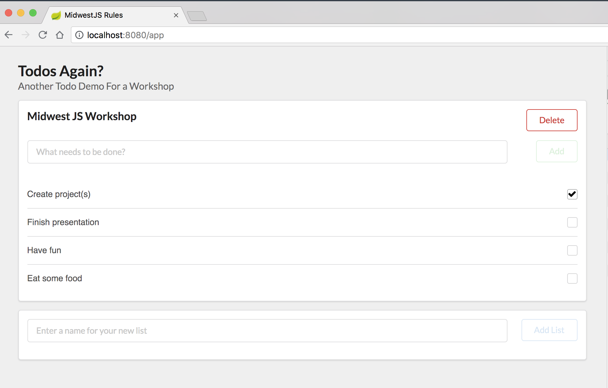

### Adding Data for Development

1. Setup json-server
  - [json-server documentation](https://github.com/typicode/json-server)

  - Create `todo-js/data` directory.

*todo-js/data/db.json*

```json
{
  "todos": [
    {
      "name": "Midwest JS Workshop",
      "id": 1
    }
  ],
  "items": [
    {
      "name": "Create project(s)",
      "todoId": 1,
      "id": 4,
      "completed": true
    },
    {
      "name": "Finish presentation",
      "todoId": 1,
      "id": 16
    },
    {
      "name": "Have fun",
      "todoId": 1,
      "id": 17
    },
    {
      "name": "Eat some food",
      "todoId": 1,
      "id": 18
    }
  ]
}
```

*todo-js/data/routes.json*

```json
{
  "/api/*": "/$1",
  "/todos": "/todos?_embed=items",
  "/todos/:id": "/todos/:id",
  "/todos/:id/items": "/todos/:id/items",
  "/todos/:todoId/items/:itemId": "/items/:itemId"
}
```

2. Create npm script to run json-server

```json
"data": "json-server --watch ./data/db.json --routes ./data/routes.json --port 8888",
```

```bash
npm run data
```

3. Setup up webpack-dev-server proxy for `/api`

```javascript
// line #57

devServer: {
  port: 8080,
  historyApiFallback: true,
  proxy: {
    "/api/**": {
      target: "http://localhost:8888",
      changeOrigin: true,
      secure: false
    }
  }
}
```

4. Have fun with the app and look at `db.json` to see how the data changes in real time.
  - Check and uncheck todos
  - Add new todos
  - Add new todo lists



5. Commit your changes

```bash
git add .

git commit -m 'json-server and configuration added to application'
```