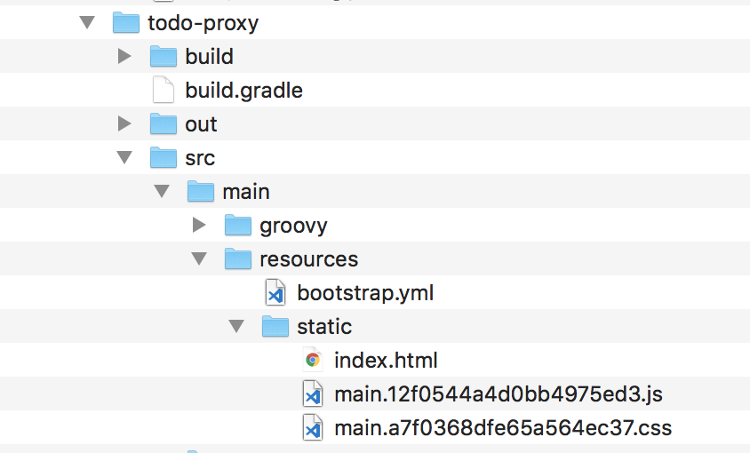
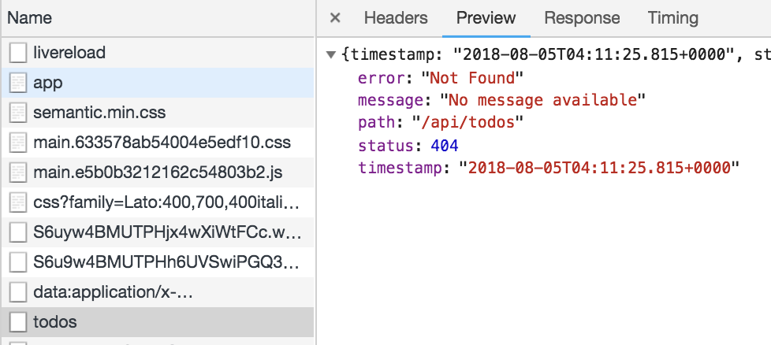

### Setup for Production builds

1. Convert Webpack's output location based upon environment

- Since `outputPath` is currently configured at `dist`, run the build and see the bundles.

*todo-js directory*
```bash
npx webpack --mode production
```

*todo-js/webpack.config.js*

```javascript
// line #7

const devMode = argv.mode === "development";
const bootStaticDirectory = path.resolve(
  __dirname,
  "../todo-proxy/src/main/resources/static"
);

let outputPath = path.resolve(__dirname, "dist");
if (!devMode) {
  outputPath = bootStaticDirectory;
}
```

2. CleanWebpackPlugin configuration

*todo-js/webpack.config.js*

```javascript
// line #4
const CleanWebpackPlugin = require("clean-webpack-plugin");

// line #44
new CleanWebpackPlugin(["dist", bootStaticDirectory], {
  watch: devMode,
  allowExternal: true
}),
```

3. Setup npm scripts for builds

*todo-js/package.json*

```json
"build": "webpack --mode production",
```

  - Run build and verify it populates `todo-proxy/src/main/resources/static` directory.



4. Update build.gradle
  - [Gradle Node plugin](https://github.com/srs/gradle-node-plugin)
  - Automatically adds `npm_run_*' to Gradle tasks

*todo-js/build.gradle*

```java
plugins {
  id "com.moowork.node" version "1.2.0"
}

description = """Javascript and React project for Todos"""

// Configure node plugin
node {
    version = '8.9.0'
}

npm_run_build.dependsOn npmInstall
```

5. In the **root** directory, run build and then run app via Gradle wrapper

*midwest-js-todos-lab root folder*

```bash
./gradlew npm_run_build
```

```bash
./gradlew bootRun
```

6. See the 404 error because we haven't set the proxy up yet..



7. Commit the changes

```bash
git add .

git commit -m 'production build created for todos'
```