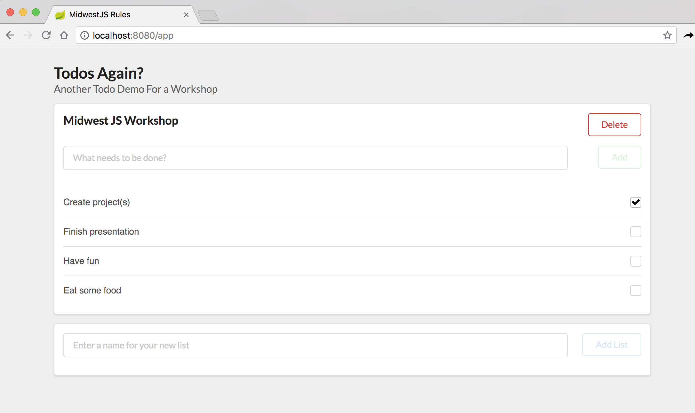

### Adding a proxy to Spring Boot

1. Add the imports to build.gradle

*todo-proxy/build.gradle*

```java
// line #35
compile "org.springframework.cloud:spring-cloud-starter-netflix-zuul:2.0.0.RELEASE"
```

2. Add task dependency so that `npm run build` runs before `bootRun`

*todo-proxy/build.gradle*

```java
bootJar.dependsOn ":todo-js:npm_run_build"
bootWar.dependsOn ":todo-js:npm_run_build"
```

3. Add the EnableZuulProxy annotation to the WebConfiguration

*todo-proxy/src/main/groovy/com/flyover/midwestjs/configuration/WebConfiguration.groovy*

```java
import org.springframework.cloud.netflix.zuul.EnableZuulProxy

@Configuration
@EnableZuulProxy
class WebConfiguration {
```

3. Add a `bootstrap.yml` configuration with the Zuul configuration

*todo-proxy/src/main/resources/bootstrap.yml*

```bash
zuul:
  routes:
    todos:
      path: /todos/**
      stripPrefix: false
      url: http://localhost:8888
    items:
      path: /items/**
      stripPrefix: false
      url: http://localhost:8888
  ignored-patterns: /app/**
  prefix: /api
```

4. Run the app

```bash
npm run data
```

```bash
./gradlew bootRun
```

5. Verify that the Proxy is working
  - Check and uncheck todos
  - Add new todos
  - Add new todo lists



6. Commit your changes

```bash
git add .

git commit -m 'Added a Zuul proxy for Api calls'
```